# Ph-UI!!!

Collaborators: Nikhil Gangaram, Viha Srinivas, Jaspreet Lal

## Part A
### Capacitive Sensing, a.k.a. Human-Twizzler Interaction 

For all sensor testing videos, you can view them in the **Lab 4/videos/sensor_tests** folder. Apologies for the lack of rendering on the GitHub side but they are rendering properly when in VSCode.

Video link: [twizzler.mov](sensor_tests/twizzler.mov)

<video width="300" height="600" controls>
  <source src="sensor_tests/twizzler.mov" type="video/mp4">
</video>

### Part B

#### Light/Proximity/Gesture sensor (APDS-9960)

Video link: [color_proximity.mov](sensor_tests/color_proximity.mov)

<video width="300" height="600" controls>
  <source src="sensor_tests/color_proximity.mov" type="video/mp4">
</video>

Video link: [color_test.mov](sensor_tests/color_test.mov)
<video width="300" height="600" controls>
  <source src="sensor_tests/color_test.mov" type="video/mp4">
</video>

Video link: [gesture_test.mov](sensor_tests/gesture_test.mov)
<video width="300" height="600" controls>
  <source src="sensor_tests/gesture_test.mov" type="video/mp4">
</video>

#### Rotary Encoder 

Video link: [encoder.mov](sensor_tests/encoder.mov)
<video width="300" height="600" controls>
  <source src="sensor_tests/encoder.mov" type="video/mp4">
</video>

#### Joystick 

Video link: [joystick.mov](sensor_tests/joystick.mov)
<video width="300" height="600" controls>
  <source src="sensor_tests/joystick.mov" type="video/mp4">
</video>

#### Distance Sensor

Video link: [proximity.mov](sensor_tests/proximity.mov)
<video width="300" height="600" controls>
  <source src="asensor_tests/proximity.mov" type="video/mp4">
</video>

### Part C
### Physical considerations for sensing

This is the AstroClicker, the idea is to have a device that helps you navigate the night sky. It uses the joystick as the primary input where the user can select what they're looking at and how far or close away to look.

Our next idea was the city Explorer, the idea is to have a device that helps you explore a new city and even find some hidden gems in the city you've been in for a while. These is the joystick that the user can use to select the next place to go, and the device will keep track of where you've been.

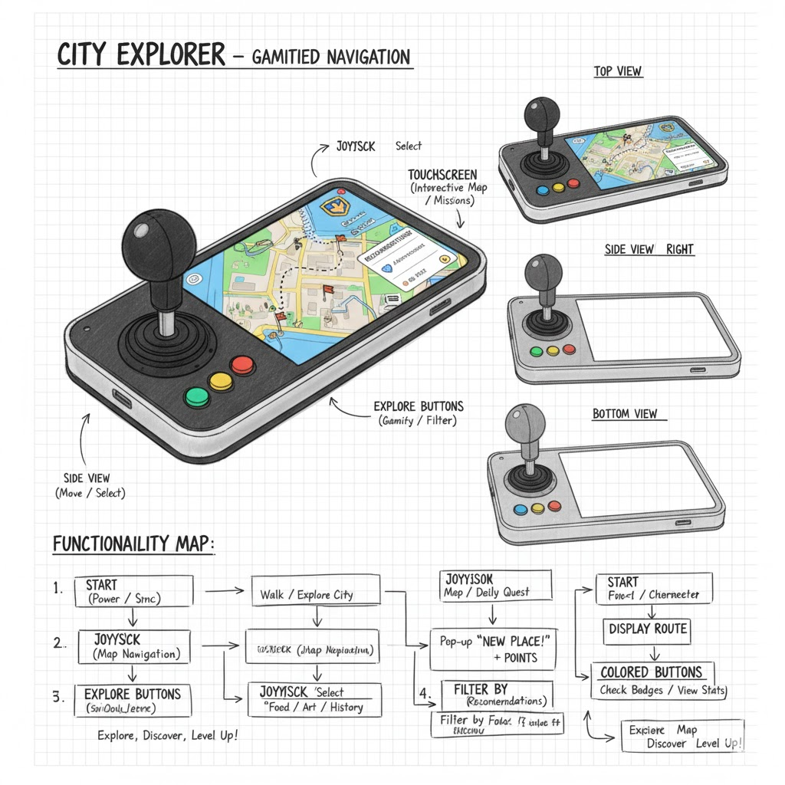

Our next idea was remote play, the idea is to have a device that allows you to remotely play with your pet. It's a combination of both a joystick input as well as a gyroscopic ball that moves around at the user command.

Our next idea was flashcards, we were inspired by devices like [Anki](https://www.ankiremote.com/) that help users learn a subject through flashcards. This was our spin on the device that allows the user to input through joystick instead of just buttons.

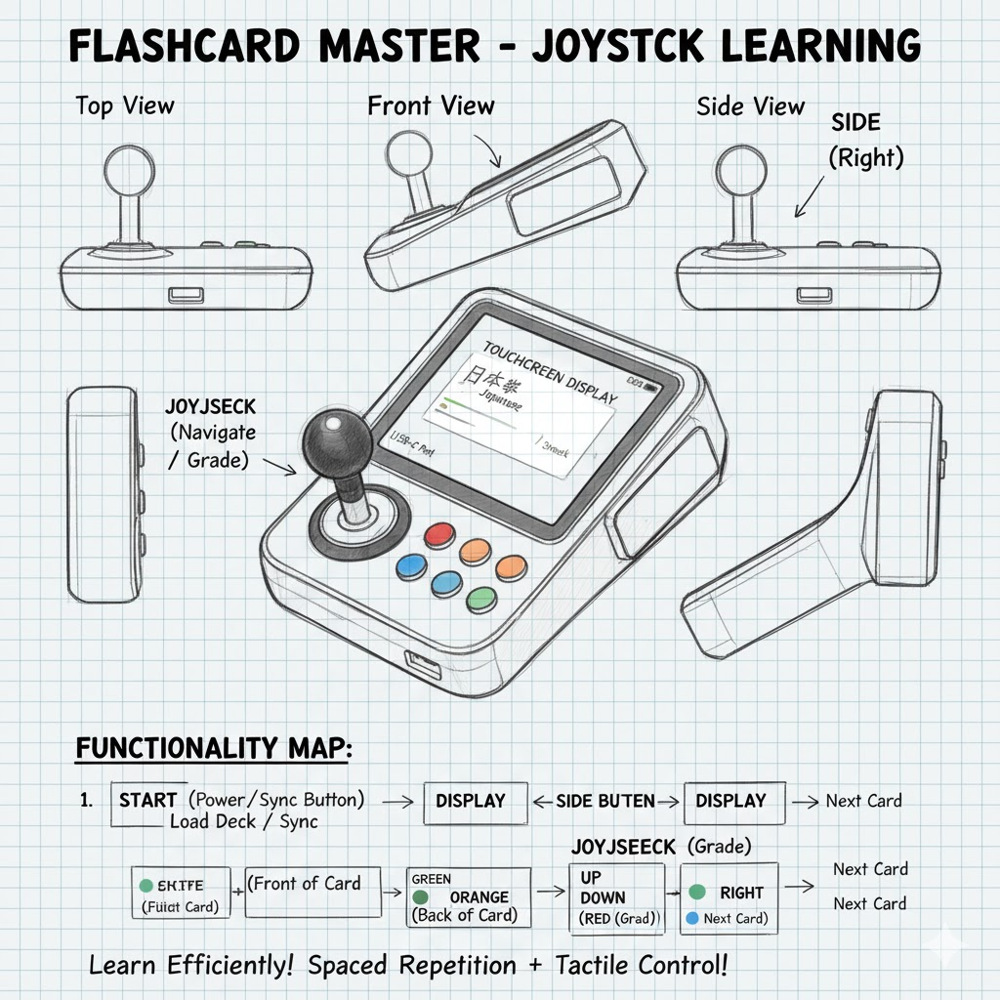

Our last idea was store navigator, the idea is to have a device that helps you navigate the labyrinth of aisles that are present in most grocery stores. The device will come preloaded with a map of whatever store you're in, and the user can navigate to an aisle and see if the item they're attempting to purchase is actually available.

Some questions that these sketches raise are:
* How can we integrate other interesting modalities besides a display that we can use interact with the user?
* How can we make this device more ergonomic?
* How can we make this device more accessible for those with disabilities?
* How can we design the user experience to have the device be easy to use well also not too hand-holdy?

We've chosen to continute working on the AstroClicker!!! 

### Part D
 
These were the different designs we came up with for the AstroClicker:

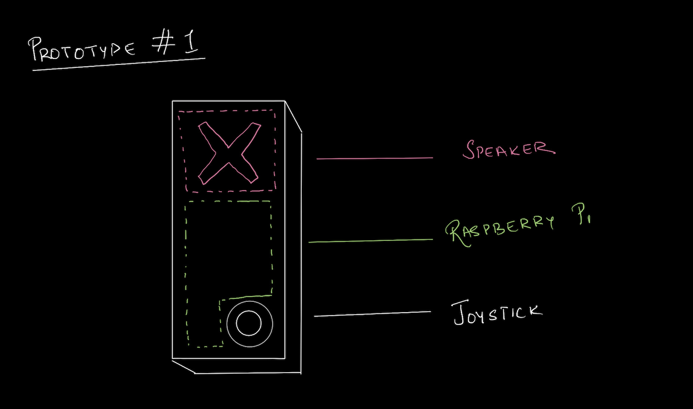
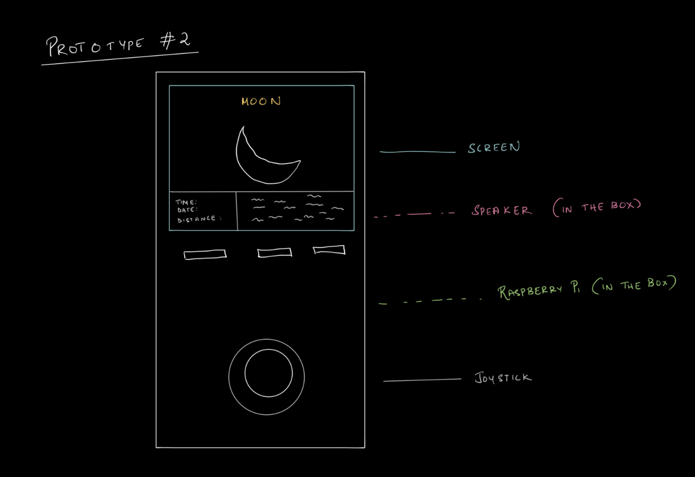
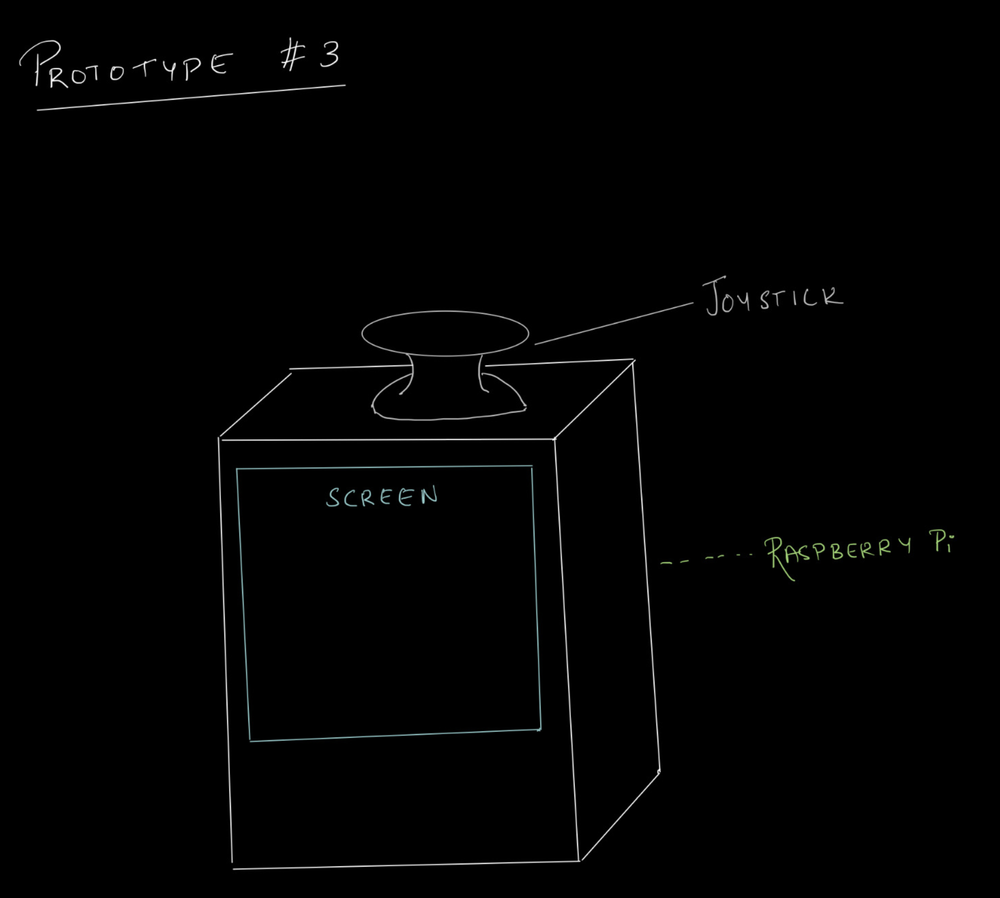
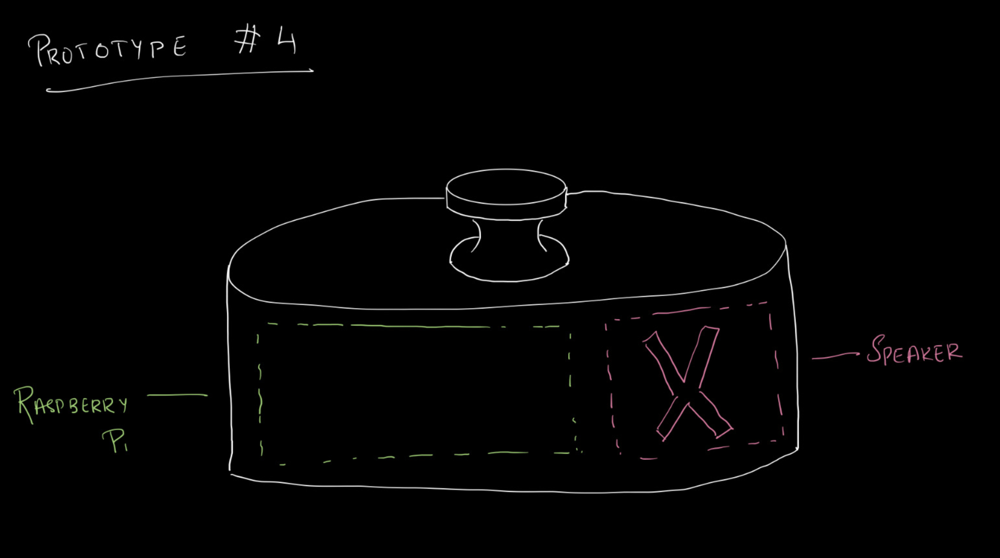
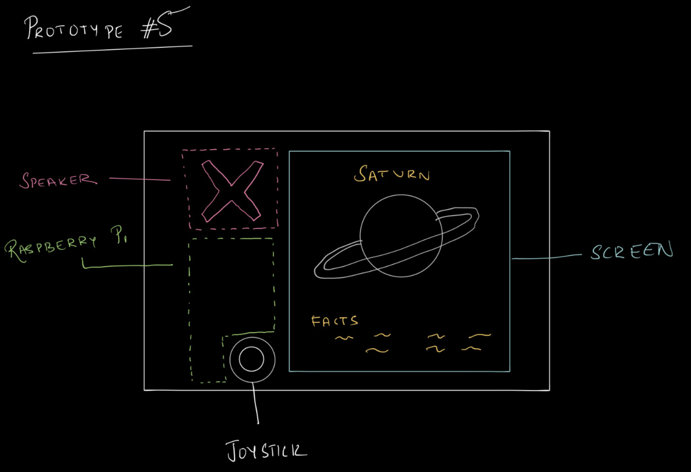

Here is some of the rationale for our initial design (which we based off of Prototype 1):
* The device will be handheld, and so the joystick should be placed in ergonomic position.
* The speaker should be facing at the user since otherwise, sound will appear to be muffled.
* The raspberry pi should have enough ventilation as to not overheat and there should be space for a battery

Build a cardboard prototype of your design. You will see that we've integrated a lot of our initial rationale behind our initial design as we do the walk-through. The placeholder, for the battery was an alto scan, and the top cut out is for ventilation for the raspberry pi.

Here is a video walk-around of the AstroClicker prototype. If this video is not rendering properly, you can view it in the **avideos** folder for the mov called **walk_around.mov**.

<video width="300" height="600" controls>
  <source src="videos/walk_around.mov" type="video/mp4">
</video>

# LAB PART 2

### Part 2

Following exploration and reflection from Part 1, complete the "looks like," "works like" and "acts like" prototypes for your design, reiterated below.

### Part E

#### Software

We first started prototyping the software for the AstroClicker prototype, which you can find in the [astro_clicker.py](astro_clicker_demo.py) file. Our main consideration when desigining teh script was that it should be user-friendly without feeling suffocating. After much prototyping, here is the code diagram that we landed on: 

#### 1. Initialization and Data Structure

* **Imports** necessary libraries for hardware, timing, subprocess execution, and argument parsing.
* The **`speak_text`** function handles text-to-speech via the external `espeak` program, logging all output to the console regardless of the active **`OUTPUT_MODE`** (`'speaker'` or `'silent'`).
* Celestial data is organized into three layers, representing distance from Earth:
    * **Layer 0 (Closest):** `CONSTELLATION_DATA`
    * **Layer 1 (Middle/Initial):** `SOLAR_SYSTEM_DATA`
    * **Layer 2 (Farthest):** `DEEP_SKY_DATA`

---

#### 2. The SkyNavigator State Machine

* The **`SkyNavigator`** class manages the user's state, tracking the **`layer_index`** (starting at 1/Solar System) and which objects have been seen using a list of **`unseen_targets`**.
* The `_set_new_target` method randomly selects an available object from the current layer; if all objects in a layer have been seen, it resets that layer's availability.
* The **`move(direction)`** method updates the state based on the joystick's intended action:
    * **'up' / 'down'**: Changes the **`layer_index`** to zoom in or out, moving between the three celestial layers. Boundary checks prevent movement past Layer 0 or Layer 2.
    * **'left' / 'right'**: Stays in the current layer and selects a **new random target** from that layer.
    * After any successful movement, the new location/target is announced via `speak_text`.

---

##### 3. Main Loop and Input Handling

* The **`runExample`** function initializes the joystick and the `SkyNavigator`.
* A welcome message and the initial target's details are spoken aloud.
* An **infinite `while` loop** continuously reads the joystick's horizontal (`x_val`), vertical (`y_val`), and button state. It uses a **debounce timer** (`MOVE_DEBOUNCE_TIME`) to prevent rapid, accidental inputs.

##### Inputs and Outputs

| Input Action | Resulting Action | Output/Narration |
| :--- | :--- | :--- |
| **Joystick Button Click (Release)** | Stays at current target. | Reads the **`name`** and **`fact`** of the current target, followed by a prompt for the next action. |
| **Joystick Up** ($\text{y\_val} > 600$) | Calls `navigator.move('up')` (Zoom Out/Farther). | Announces the zoom-out and the new target's name/type, or a boundary message. |
| **Joystick Down** ($\text{y\_val} < 400$) | Calls `navigator.move('down')` (Zoom In/Closer). | Announces the zoom-in and the new target's name/type, or a boundary message. |
| **Joystick Left** ($\text{x\_val} > 600$) | Calls `navigator.move('left')` (Scan/New Target). | Announces a scan left and the new target's name/type. |
| **Joystick Right** ($\text{x\_val} < 400$) | Calls `navigator.move('right')` (Scan/New Target). | Announces a scan right and the new target's name/type. |

---

#### 4. Entry Point

* The **`main()`** function uses the **`argparse`** module to allow the user to optionally specify the output mode (`--mode speaker` or `--mode silent`) when running the script.
* The program can be cleanly exited by pressing **Ctrl+C**.

Here is the code diagram that we landed on (with some help from Gemini): 

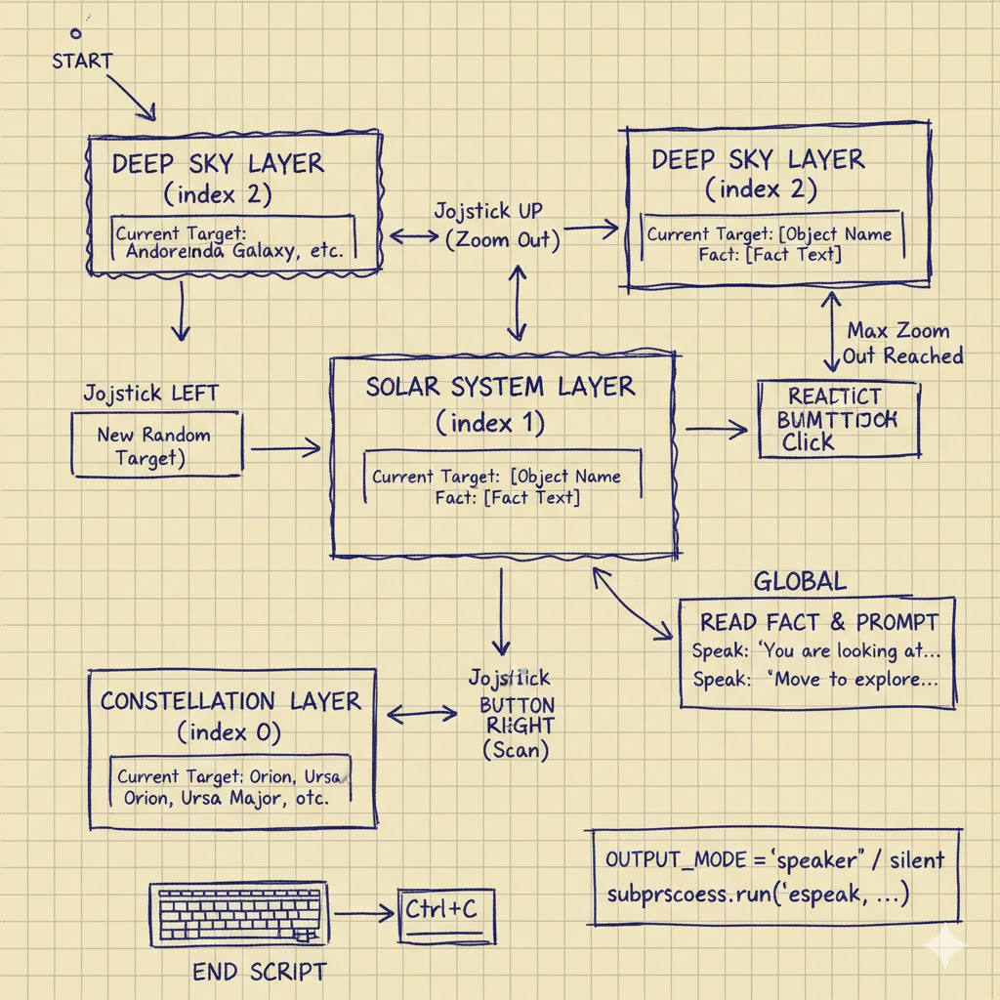

#### Hardware

We then got started on the hardware prototype, for which, these were out main considerations:

* The device will be handheld, and so the joystick should be placed in ergonomic position.
* The speaker should be facing at the user since otherwise, sound will appear to be muffled.
* The raspberry pi should have enough ventilation as to not overheat and there should be space for a battery

Most of these considerations are identical to the cardboard prototype, but we did make some changes to the hardware to make it more ergonomic. Here are some images of the prototype:

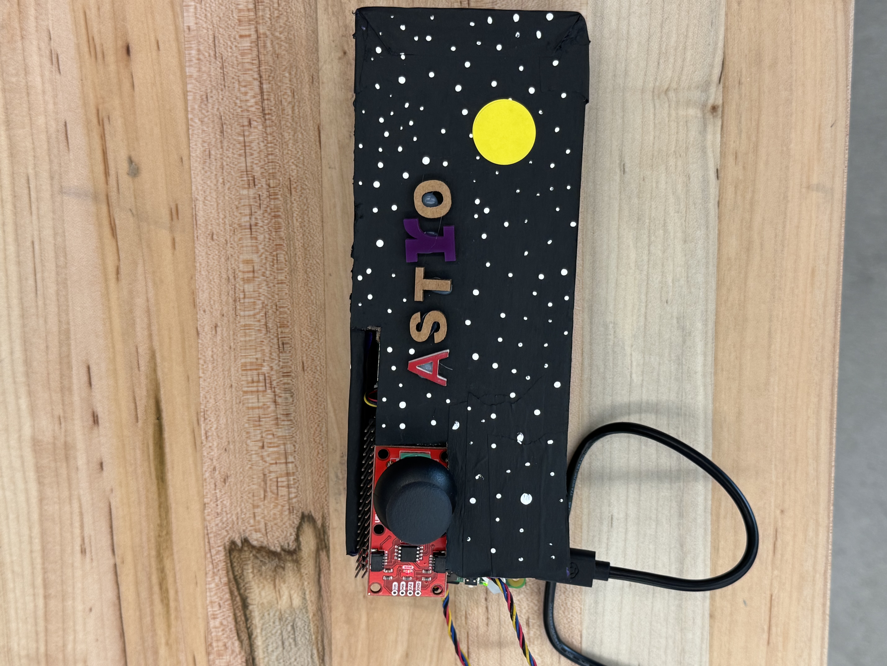
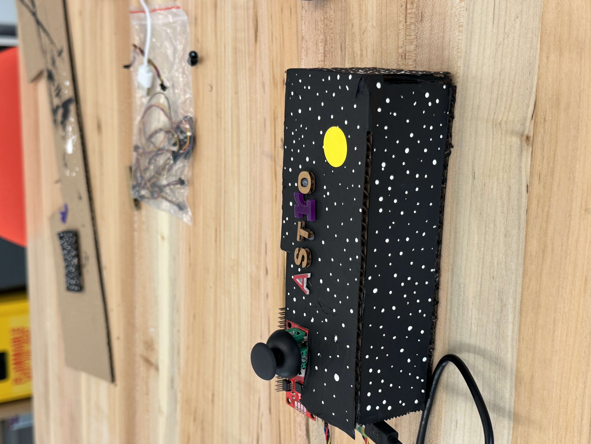
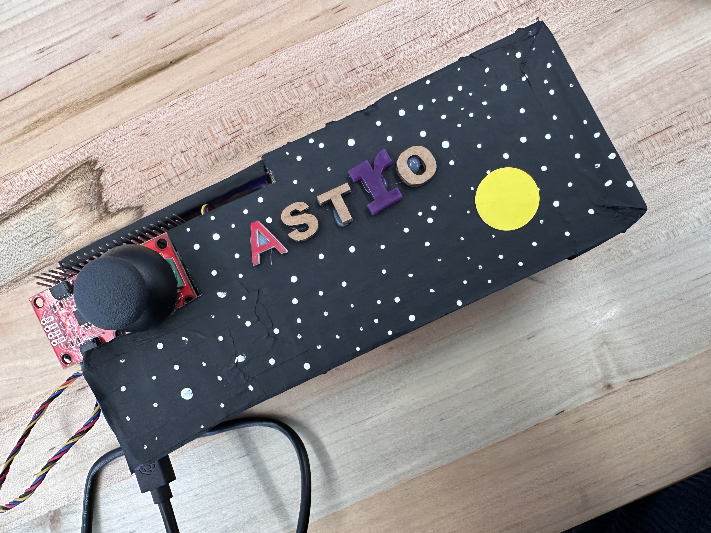

---

### Part F

Here are our two final videos with a walkthrough of the AstroClicker prototype in both software and hardware:

<video width="300" height="600" controls>
  <source src="videos/software.mov" type="video/mp4">
</video>

<video width="300" height="600" controls>
  <source src="videos/hardware.mov" type="video/mp4">
</video>

### AI Contributions 

Throughout this lab, we got help from Gemini with: 

* Generating "final" images throughout the lab. We would often sketch a rough idea on paper, and then use Gemini to refine it into a presentable image. 
* Developing and documenting the code for the AstroClicker prototype.

Everything else (ideating, eliciting feedback, designing and building the prototypes) was done by ourselves.
