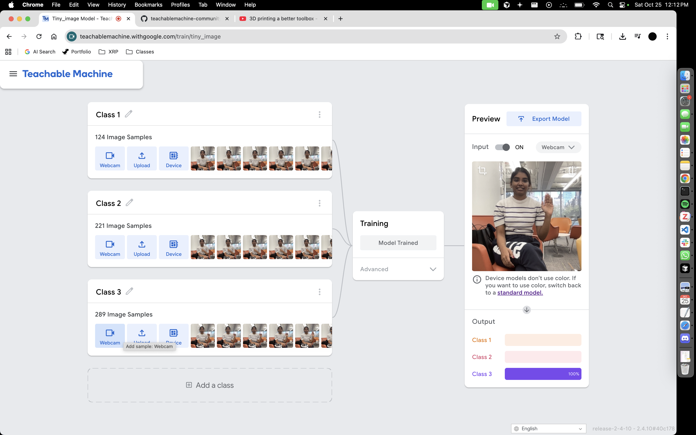
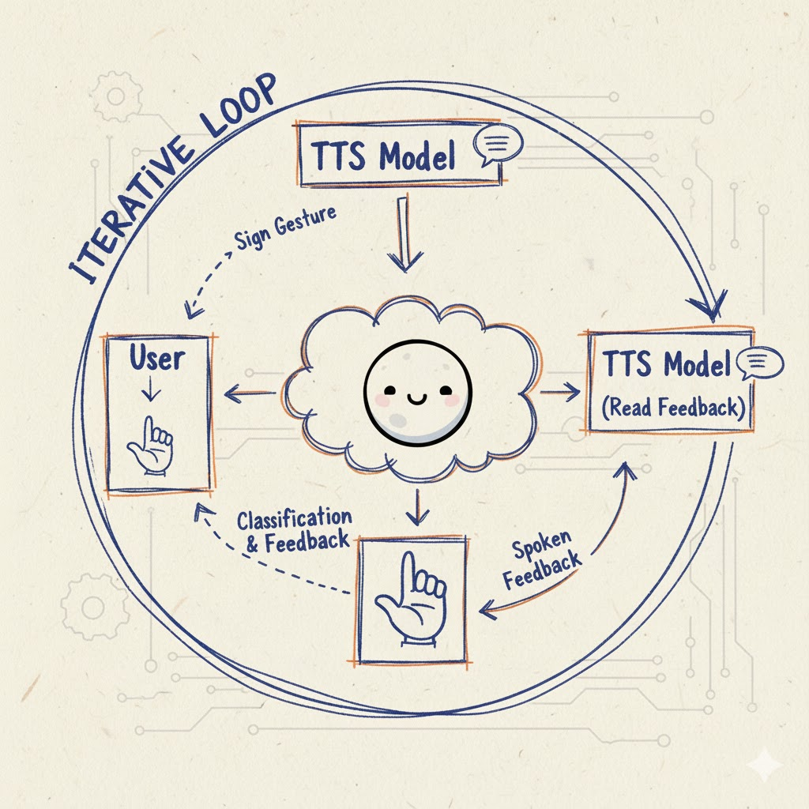

# Observant Systems

Sachin Jojode, Viha Srinivas, and Nikhil Gangaram

### Part B
### Construct a simple interaction.

We're building up to a system that can teach abled people ASL in a more personalized way. Specifically, the north star of this project is to classify the user's gesture and then use MoonDream to give them a personalized response. We first tried to build a classical model trained through Teachable Machine (here) that could classify the gesture, but it was extremely high variance. Here is a screenshot of a "good" result on Teachable Machine:

Instead, we pivoted to MoonDream, which seemed like a better fit for our task. Here is our plan for the simple interaction with MoonDream:

TTS model prompts the user to sign a gesture.
The user signs the gesture, which is then sent to MoonDream.
MoonDream classifies the gesture and returns feedback to the user.
TTS model reads the feedback and speaks it back to the user.
This could then be turned into an iterative loop, which repeats
Here is an image of the prototype flow:

### Part C
### Test the interaction prototype
Now flight test your interactive prototype and note down your observations:

After testing our prototype, we found that lighting conditions and the relative time when the image is taken of the user had the largest impact on the system's performance. If the image is taken too early or the lighting is not "right", MoonDream seems to struggle when classifying the gesture. We also found that the interaction didn't map well to how humans communicate, that is, if we were learning from a teacher, there would be more subtlety and temporal variation in the interaction which isn't present in the current, rigid back and forth interaction. The prototype code is at [moondream_sign.py](https://github.com/aryaprasad08/Interactive-Lab-Hub/blob/Fall2025/Lab%205/moondream_sign.py).

***Think about someone using the system. Describe how you think this will work.***

Are they aware of the uncertainties in the system?
How bad would they be impacted by a miss classification?
How could change your interactive system to address this?
Are there optimizations you can try to do on your sense-making algorithm.
In this case, we found that there is already implicit frustration when trying to learn a new language. Thus, if the system ever said anything wrong, there is an immediate loss of user trust. In experimenting with other platforms, we came across [Google AI Live](https://aistudio.google.com/live) which performed much better than our initial prototype. The reason for this seems to be that they feed in the video of the user as opposed to a single frame. We believe this is a more natural way to capture the interaction from the user and will be exploring this in the second part of the lab. However, even Google's model struggled with longer videos and conversations where it assumes everything the user does is correct:

Video link: [google_ai_live.mov](https://drive.google.com/drive/u/1/folders/1kyVD0gCpNef7e4qjpOGzMFXHFbWyhah2)

### Part D
### Characterize your own Observant system

Now that you have experimented with one or more of these sense-making systems **characterize their behavior**.
During the lecture, we mentioned questions to help characterize a material:

* What can you use X for?
MoonDream can be used to recognize and interpret ASL hand gestures. It helps non-signers learn basic signs by giving real-time feedback and using text to speech to make the interaction more accessible and engaging.

* What is a good environment for X?
A good environment is one with bright, even lighting, a plain background, and a stable camera. The user should be in front of the camera with their hands fully visible and minimal movement in the background.

* What is a bad environment for X?
A bad environment includes dim or uneven lighting, cluttered backgrounds, or multiple people in view. It also struggles with poor camera quality, motion blur, or when the internet connection is unstable.
  
* When will X break?
It will break when gestures are done too quickly, when part of the hand is out of frame, or when lighting suddenly changes. Timing issues, like capturing a frame too early or too late, also cause errors.
  
* When it breaks how will X break?
When it breaks, MoonDream may misclassify the gesture, fail to respond, or repeat incorrect feedback. Sometimes it freezes or outputs random labels, confusing the user.
  
* What are other properties/behaviors of X?
It is sensitive to lighting and angles, consistent in stable conditions, and quick to respond when inputs are clear. However, it doesn’t adapt to individual users yet and can’t recognize complex or blended gestures.
  
* How does X feel?
It feels experimental and a bit fragile encouraging when it works but frustrating when it fails. The interaction feels mechanical but shows potential to become a supportive learning tool for sign language practice.

**\*\*\*Include a short video demonstrating the answers to these questions.\*\*\***

### Part 2.

Following exploration and reflection from Part 1, finish building your interactive system, and demonstrate it in use with a video.

**\*\*\*Include a short video demonstrating the finished result.\*\*\***
